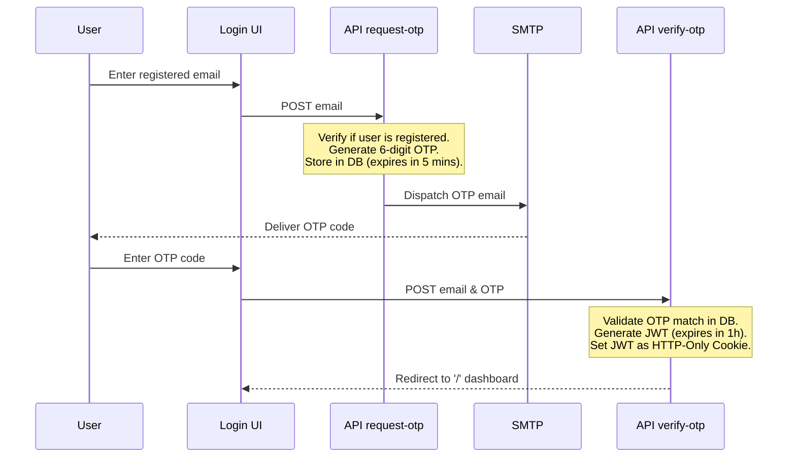
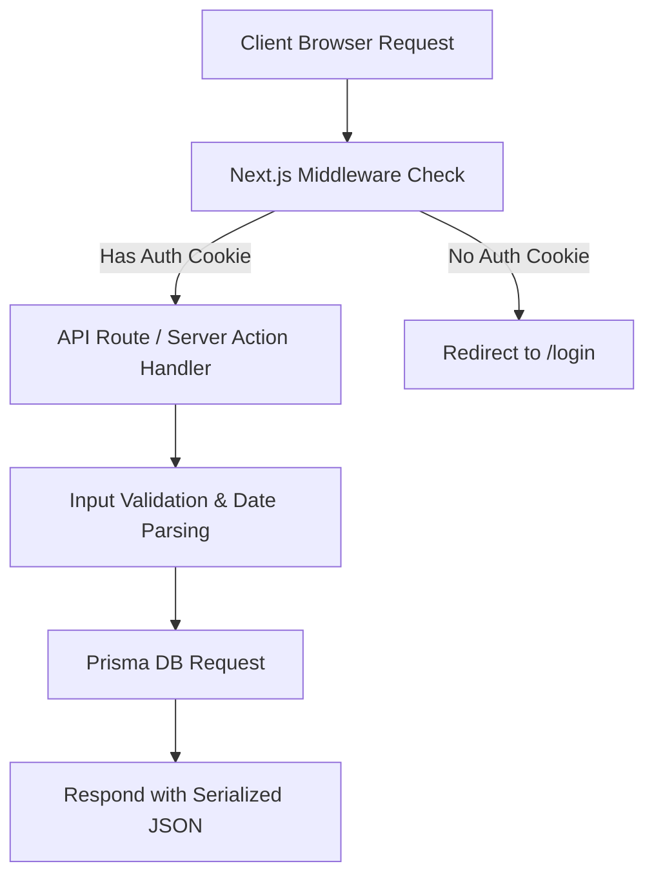

# BuildCorp ERP — Complete Technical & Functional Documentation

This document serves as the single source of truth for the architecture, implementation, security protocols, API references, database schemas, and workflows of **BuildCorp ERP**.

---

## 1. Project Overview

### Project Name
BuildCorp ERP

### Purpose
BuildCorp ERP is a modern, single-tenant, passwordless, multi-module Enterprise Resource Planning (ERP) platform designed for civil engineering and construction firms to manage government tenders, contracts, private contracting work, materials stock, supplier logistics, and financial profits in real time.

### Business Problem Solved
Small-to-medium civil contractors often struggle with:
1. **Disconnected Data:** Disparate logs for materials purchases (Cement/Tar) vs. site deliveries.
2. **Regulatory Deadlines:** Missing critical dates for government contract compliance (agreement sign deadlines, stamp paper requirements, site handovers).
3. **Connection Connection & Scaling Inefficiencies:** Connection limits on database services due to serverless functions scaling up during query bursts.
4. **Profitability Blind Spots:** The inability to compute real-time margins per project by aggregating material bills, logistics expenses, and execution costs under GST constraints.

### Target Users
* **Executive Administrators:** Oversee all projects, financials, margins, and audits.
* **Project Managers / Site Engineers:** Monitor deliverables, update statuses, record site material consumption.
* **Store & Logistics Managers:** Log cement and tar tankers arriving from suppliers.

### Main Modules & Feature List
* **Interactive KPIs & Dashboard:** Real-time analytics showing total valuation, active projects, cement/tar stock, and alerts.
* **Cement Load Management:** Log supplier invoices, quantities, and balances.
* **Tar Load Management:** Track Bitumen tankers, addressed PWD/NHAI offices, and payments.
* **Government Contract Entry:** Track LOA, Agreement deadlines, stamp paper values, and overseer/engineer contact details.
* **Stock Register:** Global ledger for Cement, RS1, SS1, and VG30 Bitumen.
* **Site Materials Reconciliation:** Track estimated vs. delivered quantities on-site.
* **Private Work Entry:** Register non-tender projects, advance deposits, and completed dates.
* **Work Based Entry (BOQ):** Build detailed item lists (Bill of Quantities) with custom rates and units.
* **Office Wise Work List:** Group and filter public projects by administrative offices (e.g., PWD, NHAI, Block).
* **Work Status & Milestones:** Track completion phases (Not Started, Ongoing, Pending, Completed).
* **Expense Management:** Track labor, equipment, and administrative costs.
* **Profitability Calculator:** Automated profitability reports including 18% GST simulations on cost and revenue.

---

## 2. Technology Stack

### Core Frameworks & Runtime
* **Runtime Environment:** Node.js (v18+)
* **Application Framework:** Next.js (v16.2.7) — utilizing a hybrid setup:
  * **App Router (`src/app/`):** Drives Server Actions (`src/app/actions.ts`), Page Layouts, and API Route handlers (`src/app/api/`).
  * **Pages Router (`src/pages/`):** Hosts the legacy routing paths, API routes for authentication (`/api/request-otp`, `/api/verify-otp`, `/api/logout`), and client entrypoints for backward compatibility.
* **UI Library:** React (v19.2.4)

### Databases & ORMs
* **Primary Database:** MongoDB Atlas (NoSQL cloud database).
* **Object-Relational Mapping (ORM):** Prisma Client (v6.19.3) utilizing the `@prisma/client-js` generator.

### Authentication & Middleware
* **Authentication Method:** Passwordless One-Time Password (OTP) validation.
* **Token Standard:** JSON Web Token (JWT) signed with `jsonwebtoken` (v9.0.3).
* **Session Strategy:** HttpOnly, Secure, SameSite=Strict cookies.
* **Security Headers:** Helmet (v8.2.0) and CORS (v2.8.6).
* **Middleware Engine:** `express-rate-limit` (v8.5.2) and `cookie-parser` (v1.4.7) wrapped in `next-connect` for API protection.

### UI / Styling / Tables
* **Styling Framework:** Tailwind CSS (v4.3.1) with PostCSS.
* **Icons:** Lucide React (v1.17.0).
* **Animation Engine:** Framer Motion (v12.40.0).
* **Data Visualizations:** Recharts (v3.8.1).
* **Data Grid Engine:** TanStack React Table (v8.21.3).
* **Form Validation:** React Hook Form (v7.77.0) and Zod (v4.4.3).

### Third-Party Services
* **Mail Dispatch:** Nodemailer (v9.0.1) integrating Gmail SMTP server.
* **Infrastructure Host:** Netlify (using `@netlify/plugin-nextjs`).

---

## 3. Folder Structure

```
designWerb/
├── .next/                     # Next.js build compilation cache
├── node_modules/              # Dependency packages
├── prisma/                    # Database configurations
│   └── schema.prisma          # Main Prisma model declarations
├── public/                    # Static resources (favicon, images)
├── src/                       # Application code root
│   ├── app/                   # Next.js App Router (Layouts & Actions)
│   │   ├── api/               # Serverless App Router API Endpoints
│   │   ├── actions.ts         # Centralised Server Actions file
│   │   ├── layout.tsx         # Global frame and metadata
│   │   └── page.tsx           # Dashboard landing route
│   ├── components/            # Reusable UI component modules
│   │   ├── views/             # Major tab and module dashboards
│   │   │   ├── dashboard-view.tsx
│   │   │   └── modules.tsx    # Contains all modular views & forms
│   │   ├── client-auth-page.tsx
│   │   ├── dashboard-portal.tsx
│   │   └── login-view.tsx
│   ├── lib/                   # Shared libraries and utilities
│   │   ├── auth/              # Auth managers (JWT, SMTP, User models)
│   │   ├── db-service.ts      # Core business operations handler
│   │   ├── logger.ts          # Centralised console logger
│   │   ├── otp-store.ts       # Database helper for verification codes
│   │   ├── prisma.ts          # Prisma client global singleton
│   │   └── types.ts           # Typescript interfaces declarations
│   ├── middleware/            # API Route guards
│   │   ├── authGuard.ts
│   │   ├── rateLimiter.ts
│   │   └── security.ts
│   ├── pages/                 # Legacy Pages Router (APIs and compat redirections)
│   │   ├── api/               # Legacy api routes (Authentication endpoints)
│   │   ├── _app.tsx
│   │   ├── dashboard.tsx      # Redirect handler to '/'
│   │   └── login.tsx          # Login page wrapper
│   └── styles/
│       └── globals.css        # Tailwind directives and CSS variables
├── .env                       # Environment variables
├── netlify.toml               # Netlify configuration file
├── tailwind.config.js         # Styling rules
└── tsconfig.json              # TypeScript compilation rules
```

---

## 4. Database Design

BuildCorp ERP utilizes MongoDB Atlas. Because Prisma is configured with the `mongodb` provider, all tables map directly to Collections, and `@map("_id")` mappings are used to support standard database ID formats.

### Complete Prisma Schema (`prisma/schema.prisma`)

```prisma
datasource db {
  provider = "mongodb"
  url      = env("DATABASE_URL")
}

generator client {
  provider = "prisma-client-js"
}

model Otp {
  id        String   @id @default(cuid()) @map("_id")
  email     String
  otpCode   String
  expiresAt DateTime
  createdAt DateTime @default(now())
}

model AuditLog {
  id        String   @id @default(cuid()) @map("_id")
  username  String
  action    String
  entity    String
  entityId  String?
  details   String?
  userId    String?
  timestamp DateTime @default(now())
}

model Notification {
  id        String   @id @default(cuid()) @map("_id")
  type      String
  message   String
  isRead    Boolean  @default(false)
  createdAt DateTime @default(now())
}

model CementLoad {
  id                        String    @id @default(cuid()) @map("_id")
  ownerEmail                String
  purchasedFrom             String
  cementCompany             String
  loadInTonne               Float
  loadInBags                Int
  amountPerLoad             Float
  paidAmount                Float
  balanceAmount             Float
  purchaseDate              DateTime
  buyerName                 String
  invoiceNumber             String
  remarks                   String?
  workId                    String?
  createdAt                 DateTime  @default(now())
  currentStockDate          DateTime?
  currentStockQty           Int?
  currentStockUsed          Int?
  currentStockBalance       Int?
  currentStockUsedAmount    Float?
  currentStockBalanceAmount Float?
  paymentPartyName          String?
  paymentBillAmount         Float?
  paymentBillDate           DateTime?
  paymentPaidAmount         Float?
  paymentBalanceAmount      Float?
  paymentRemarks            String?
  deletedAt                 DateTime?
}

model Entry {
  id                               String    @id @default(cuid()) @map("_id")
  ownerEmail                       String
  workName                         String
  amount                           Float
  nameOfOffice                     String
  mlaMpName                        String?
  loaReceived                      Boolean   @default(false)
  lastDateToExecuteAgreement       DateTime
  amountOfStampPaperRequired       Float
  securityAmount                   Float
  performanceGuarantee             Float
  dlpPeriodAsPerInLOA              String
  agreementNo                      String
  siteHandoverDate                 DateTime
  workCompletionDateAsPerAgreement DateTime
  wardMemberName                   String?
  wardMemberPhone                  String?
  overseerName                     String?
  overseerPhone                    String?
  executiveEngineerName            String?
  executiveEngineerPhone           String?
  assistantEngineerName            String?
  assistantEngineerPhone           String?
  blockEngineerName                String?
  blockEngineerPhone               String?
  status                           String    @default("Not Started")
  paymentReceived                  Float     @default(0)
  gstApplicable                    Boolean   @default(false)
  createdAt                        DateTime  @default(now())
  updatedAt                        DateTime  @updatedAt
  deletedAt                        DateTime?
}

model StockRegisterItem {
  id             String   @id @default(cuid()) @map("_id")
  ownerEmail     String
  materialName   String
  inBarrel       Int      @default(0)
  inKg           Float    @default(0)
  inTonne        Float    @default(0)
  usedInTonne    Float    @default(0)
  balanceInTonne Float    @default(0)
  updatedAt      DateTime @updatedAt
}

model SiteMaterial {
  id                     String    @id @default(cuid()) @map("_id")
  ownerEmail             String
  entryId                String
  type                   String
  itemSlNo               String
  specName               String
  unit                   String?
  estimatedQuantity      Float
  deliveredQuantityInCft Float
  balanceQuantityInCft   Float
  totalQuantityInSite    Float
  createdAt              DateTime  @default(now())
  deletedAt              DateTime?
}

model PrivateWork {
  id                   String    @id @default(cuid()) @map("_id")
  ownerEmail           String
  workName             String
  approxAmount         Float
  location             String
  relatedToContractWork String?
  siteVisitDate        DateTime
  roadWorkNature       String
  completedDate        DateTime
  advanceReceived      Float
  approxFinalWorkAmount Float
  paymentReceived      Float     @default(0)
  paymentBalance       Float     @default(0)
  remarks              String?
  gstApplicable        Boolean   @default(false)
  createdAt            DateTime  @default(now())
  workType             String?
  finalWorkAmount      Float?
  completionDate       DateTime?
  deletedAt            DateTime?
}

model TarLoad {
  id                        String    @id @default(cuid()) @map("_id")
  ownerEmail                String
  purchasedFrom             String
  item                      String
  quantityInKg              Float
  loadInNoOfPack            Int
  addressedOffice           String
  paidAmount                Float
  balanceToBePaid           Float
  purchasedDate             DateTime
  billingNameBuyer          String
  remarks                   String?
  amountPerLoad             Float
  workId                    String?
  createdAt                 DateTime  @default(now())
  currentStockDate          DateTime?
  currentStockQty           Int?
  currentStockUsed          Int?
  currentStockBalance       Int?
  currentStockUsedAmount    Float?
  currentStockBalanceAmount Float?
  paymentPartyName          String?
  paymentBillAmount         Float?
  paymentBillDate           DateTime?
  paymentPaidAmount         Float?
  paymentBalanceAmount      Float?
  paymentRemarks            String?
  deletedAt                 DateTime?
}

model WorkBasedEntry {
  id                    String   @id @default(cuid()) @map("_id")
  ownerEmail            String
  entryId               String
  itemSlNo              String
  itemName              String
  itemQuantity          Float
  itemRateAsPerEstimate Float
  totalAmountPerItem    Float
  itemUnit              String
  createdAt             DateTime @default(now())
}

model Expense {
  id          String    @id @default(cuid()) @map("_id")
  ownerEmail  String
  workId      String
  date        DateTime
  description String
  amount      Float
  createdAt   DateTime  @default(now())
  deletedAt   DateTime?
}
```

---

## 5. Authentication

BuildCorp ERP uses a passwordless login system to authenticate registered users.



### Key Parameters
* **JWT Token Contents:** `{ id, email, name, role }`
* **JWT Cookie Settings:** `auth_token=[token]; HttpOnly; Path=/; Max-Age=3600; SameSite=Strict; [Secure in Production]`
* **Legacy Credentials Bypass:** For development / test integration, matching credentials against `test@buildcorp.com` bypasses SMTP delivery and sets a constant OTP code (`999999`).
* **Session Terminations:** Calling `/api/logout` sets cookie expiration to the past (`Max-Age=0`).

---

## 6. User Roles

Currently, the system acts under a single access control matrix. The role assigned during login matches standard profiles:

| Role Name | Scope | Permissions | Accessible Modules |
| :--- | :--- | :--- | :--- |
| **ADMIN** | System-Wide | Full Read, Write, Update, Delete on all collections | Dashboard, Cement, Tar, Expenses, Contracts, Stock, BOQ, Profitability |
| **VIEWER** | Audits | Read-only access to components (Planned) | Dashboard, Stock Register, Work Lists |

*Multi-tenancy constraints partition all data transactions based on the authenticated email from the JWT payload (`ownerEmail` checks on all operations).*

---

## 7. Module Documentation

### Dashboard
* **Purpose:** High-level metrics view and notifications center.
* **Workflow:** Aggregates metrics (Active contracts count, materials stocked, active loads balances). Computes warning alerts for contract completion timelines.
* **Pages:** `/`

### Cement Load
* **Purpose:** Logs bulk cement purchases, bills, and stockpiles.
* **Workflow:** Fields collect tonnage, bags, price, and payment terms. Modifying cement loads automatically triggers recalculation of the central stock register.

### Tar Load
* **Purpose:** Bitumen emulsion logistics tracker.
* **Workflow:** Registers incoming tanker delivery packets (RS1, SS1, VG30). Connects materials to specific road/construction contracts.

### Stock Register
* **Purpose:** Real-time visual ledger representing available company-wide materials.
* **Workflow:** Reads and displays calculated balances for Cement (in tonnes/bags) and Tar aggregates (RS1, SS1, VG30).

### Materials Used in Site
* **Purpose:** Reconciles deliverables per job site.
* **Workflow:** Compares estimated quantity required against actual delivered quantities. Calculates outstanding balance.

### Work Status Updation
* **Purpose:** Updates timelines for government contract executions.
* **Workflow:** Stages contracts through status cycles (`Not Started`, `Ongoing`, `Pending`, `Completed`). Updates payments received.

---

## 8. API Documentation

### POST `/api/request-otp`
* **Purpose:** Generate and email a 6-digit OTP code.
* **Authentication:** None.
* **Payload:** `{ "email": "test@buildcorp.com" }`
* **Response (200):** `{ "success": true, "message": "OTP sent to test@buildcorp.com" }`
* **Response (400):** `{ "success": false, "error": "Email is required" }`

### POST `/api/verify-otp`
* **Purpose:** Match OTP and issue cookie-based session.
* **Authentication:** None.
* **Payload:** `{ "email": "test@buildcorp.com", "otp": "999999" }`
* **Response (200):** `{ "success": true, "user": { "id": "u-test", "email": "test@buildcorp.com" } }`

### GET `/api/profit-calculation/[workId]`
* **Purpose:** Calculates profitability breakdown for a specific contract or private work.
* **Authentication:** Required (via HTTP-Only Cookie validation).
* **Response (200):**
```json
{
  "workId": "entry-id",
  "workName": "NH Road Work",
  "agreedAmount": 500000,
  "gstPercentage": 18,
  "gstAmount": 90000,
  "agreedAmountWithGST": 590000,
  "materialsCost": 250000,
  "executionExpense": 50000,
  "totalExpense": 300000,
  "totalExpenseWithGST": 354000,
  "overallProfit": 236000,
  "profitPercentage": 40.0
}
```

---

## 9. Business Logic

### Stock Register Recalculation
Whenever a Cement Load or Tar Load is created/updated/deleted, the system automatically runs the following aggregation loop in `src/lib/db-service.ts`:
1. Sum all active `CementLoad.loadInTonne` $\rightarrow$ `Cement.inTonne`.
2. For Tar types (`RS1`, `SS1`, `VG30`):
   * Sum matching `TarLoad.quantityInKg` / 1000 $\rightarrow$ `inTonne`.
   * Sum `TarLoad.loadInNoOfPack` $\rightarrow$ `inBarrel`.
3. Sum matching `SiteMaterial.deliveredQuantityInCft` where type is `delivered` $\rightarrow$ `usedInTonne`.
4. Calculate balance: `balanceInTonne = inTonne - usedInTonne`.
5. Write results into `StockRegisterItem` collection.

### Profit Calculation Formula
$$\text{GST Amount} = \text{Agreed Amount} \times \frac{\text{GST \%}}{100}$$
$$\text{Agreed Amount With GST} = \text{Agreed Amount} + \text{GST Amount}$$
$$\text{Total Expense} = \text{Materials Cost} + \text{Execution Expense}$$
$$\text{Total Expense With GST} = \text{Total Expense} \times 1.18$$
$$\text{Overall Profit} = \text{Agreed Amount With GST} - \text{Total Expense With GST}$$
$$\text{Profit Percentage} = \left( \frac{\text{Overall Profit}}{\text{Agreed Amount With GST}} \right) \times 100$$

---

## 10. Validation Rules

* **Client-Side Validation:** UI forms enforce numeric constraints on financial amounts and check for required string fields using simple React state validations and dynamic HTML validation attributes before dispatching server action requests.
* **Server-Side Validation:** Dates are strictly parsed and verified via `parseDates` prior to database insertion. Zod validation ensures type safety across incoming API routes.

---

## 11. Security Matrix

* **Authentication:** OTP system prevents password leakage/cracking.
* **Token Storage:** HttpOnly cookies prevent Javascript-based token stealing (XSS). SameSite setting blocks CSRF.
* **Rate Limiting:** Guarded via `express-rate-limit` middleware at 5 requests/min per IP to protect SMTP resources from denial-of-service abuse.
* **Audit Logging:** An `AuditLog` structure tracks system actions dynamically to maintain traceability.

---

## 12. Performance Optimizations

1. **Prisma Client Singleton:**
   Instantiated in `src/lib/prisma.ts` using `globalThis` to avoid database connection exhaustion across serverless cold starts.
2. **Aggregated Server Handlers:**
   `getDashboardDataAction` queries all core lists simultaneously using `Promise.all`, returning a combined state response in a single transaction.
3. **Database Indexing:**
   Fields containing `ownerEmail` and logical link fields (e.g., `entryId`, `workId`) are structured for default index configurations in MongoDB to ensure sub-millisecond query execution.

---

## 13. Architecture Diagrams

### Application Request Lifecycle



---

## 14. UI Pages & Components

* **Dashboard View:** Contains statistics grids, recent alerts, modules list, and navigation buttons.
* **Form Modals:** Embedded in `modules.tsx` for adding and updating entries, loads, or expenses. Supports inputs for dates, numbers, and toggle switches.
* **Interactive Lists:** Feature filter boxes, CSV exporters, print layouts, and deletion triggers.

---

## 15. Configuration

### Environment Variables
* `DATABASE_URL`: MongoDB Connection URI.
* `JWT_SECRET`: Secret token signature key.
* `JWT_EXPIRES_IN`: JWT expiration length (defaults to `1h`).
* `SMTP_USERNAME` / `SMTP_PASSWORD`: Credentials for Nodemailer Gmail transport.
* `SMTP_FROM_NAME`: Display name on sent authentication emails.
* `OTP_EXPIRES_MIN`: Time before OTP code expires (defaults to `5`).

---

## 16. Deployment

* **Hosting Provider:** Netlify
* **Build Command:** `npm run build`
* **Publish Directory:** `.next`
* **Plugin Configuration:** Uses `@netlify/plugin-nextjs` for serverless route resolution.

---

## 17. Complete Feature Checklist

* [x] Passwordless OTP Authentication Flow
* [x] Multi-Tenant Data Scoping (`ownerEmail`)
* [x] Cement Load Management
* [x] Tar Load Management
* [x] Contract Entry Register
* [x] Real-Time Stock Register updates
* [x] Materials Site Reconciliation
* [x] Private Contracting Work Entry
* [x] Expense Tracking
* [x] Dynamic Profitability Calculator
* [ ] Role-Based User Management Panel (Planned)
* [ ] Multi-tenant isolation configuration panel (Planned)

---

## 18. Source Code Statistics

* **Estimated Files:** ~30 Source Files
* **Primary Components:** ~15 Main Component structures
* **API Endpoints:** 4 core route modules
* **Database Collections:** 9 Collections
