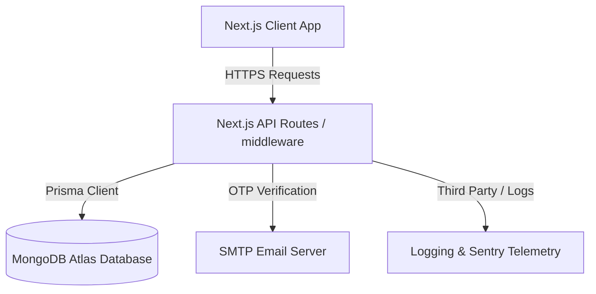
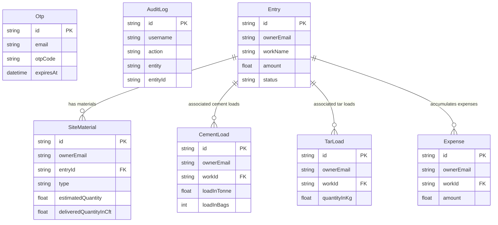
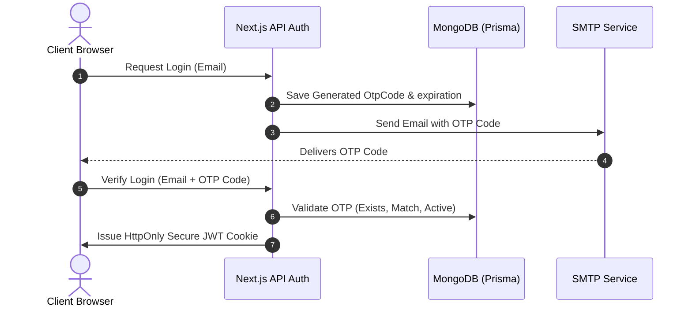

# SYSTEM DESIGN ARCHITECTURE — BUILDCORP ERP

This document outlines the high-level system design, database architecture, module interfaces, security schema, and infrastructure topology for the BuildCorp ERP application.

---

## 1. System Architecture Overview

BuildCorp ERP is designed as a modular, single-database enterprise resource planning web application. It leverages a modern hybrid architecture built on Next.js, serving both dynamic client-side views and secure serverless backend functions.

### Key Architectural Layers

1. **Presentation Layer (Next.js Pages & Components):**
   * Built with React and Tailwind CSS.
   * Utilizes custom hooks to separate UI representation from data fetching/mutations.
   * Leverages optimistic state updates for responsive data-heavy views.

2. **Application & API Layer (Next.js Backend):**
   * Exposes JSON API endpoints and Next.js middleware.
   * Performs request preprocessing (rate-limiting, JWT parsing, and role/authorization checks).
   * Implements strict server-side validation using **Zod**.

3. **Data Access Layer (Prisma ORM):**
   * Abstracts database-specific syntax (MongoDB Atlas).
   * Employs centralized connection pooling to handle serverless execution environments safely.
   * Uses an audit-log generator to track database mutations globally.

---

## 2. Database Design & Schema

BuildCorp ERP uses MongoDB Atlas as its primary datastore, mapped via **Prisma ORM**. The data model supports multi-tenancy at the data level through an `ownerEmail` field on every record.

### Core Schema Entity Relationships

### Module Descriptions
* **Authentication (`Otp`):** Tracks verification codes sent via email to log in users securely without passwords.
* **Contract Work (`Entry`):** The central entity representing construction projects, agreement deadlines, billing amounts, and local government officials' contact details.
* **Site Materials (`SiteMaterial`):** Coordinates material supply logs, balancing estimated quantities against actual quantities delivered to the job site.
* **Stock & Logistics (`CementLoad` / `TarLoad` / `StockRegisterItem`):** Tracks incoming raw materials from external suppliers, stock consumption rates, and balances.
* **Accounting (`Expense` / `PrivateWork` / Payments):** Monitors financial progress, expenses incurred per contract work, and billing status.

---

## 3. Data Flow & Security Integration

### 3.1 Authentication Flow (OTP & JWT)
BuildCorp ERP implements a passwordless, token-based authentication mechanism.

### 3.2 Security Matrix
* **Access Control:** All API endpoints and page routes check for the presence of a valid JWT token via Next.js Middleware. If invalid, the request is redirected to `/login`.
* **Input Sanitization:** Every API route verifies its payload against a strict Zod schema before database insertion, mitigating injection and malformed-payload vulnerabilities.
* **Rate Limiting:** Sensitive endpoints (e.g., OTP request and verify endpoints) are guarded with middleware to limit operations to a maximum of requests per IP/account per minute.

---

## 4. Performance & Scalability Design

Because the application is deployed on serverless hosting (such as Netlify/Vercel) and queries MongoDB Atlas, the system designs for resource efficiency:

1. **Prisma Client Singleton:**
   Prevents connection leaks by instantiating a single global database client instance that persists across hot-restarts of serverless containers.
2. **Aggregated API Queries:**
   Combines dashboard calculations and metrics (e.g., total spent, materials balance) into centralized API calls to minimize round-trip times and client-side page load latency.
3. **Database Indexing Strategy:**
   MongoDB indexes are defined on frequently queried and sorted fields:
   * `ownerEmail` (for multi-tenant data scoping)
   * `entryId` (for lookups and relation queries)
   * `deletedAt` (to handle soft-deletes quickly)
